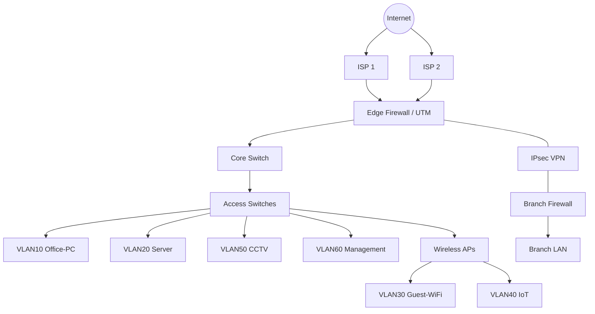

# Network Topology

```mermaid
flowchart TD
    Internet((Internet))
    ISP1[ISP 1]
    ISP2[ISP 2]
    FW[Edge Firewall / UTM]
    Core[Core Switch]
    Access[Access Switches]
    AP[Wireless APs]
    VPN[IPsec VPN]
    BranchFW[Branch Firewall]
    BranchLAN[Branch LAN]

    User[VLAN10 Office-PC]
    Server[VLAN20 Server]
    Guest[VLAN30 Guest-WiFi]
    IoT[VLAN40 IoT]
    CCTV[VLAN50 CCTV]
    Mgmt[VLAN60 Management]

    Internet --> ISP1 --> FW
    Internet --> ISP2 --> FW
    FW --> Core
    FW --- VPN --- BranchFW --> BranchLAN
    Core --> Access
    Access --> User
    Access --> Server
    Access --> CCTV
    Access --> Mgmt
    Access --> AP
    AP --> Guest
    AP --> IoT
```
